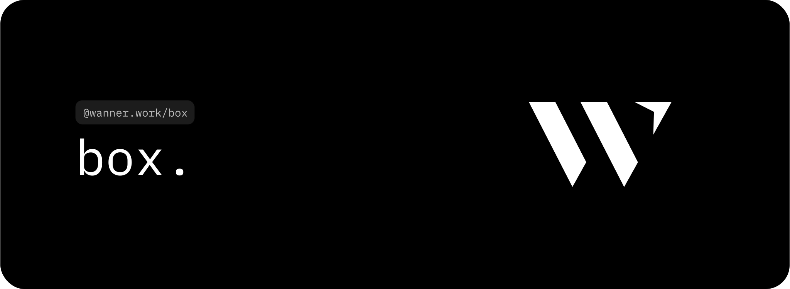

# box.

An opinionated layout container component to force a consistent layout across your application.

## Prerequisites

Only use this package if you are building with [tailwindcss](https://tailwindcss.com/) and the newest version
of [react](https://react.dev/).

## Installation

1. Install the package using pnpm: `pnpm add @wanner.work/box`.
2. Add the following line to your `tailwind.config.js` content configuration: (if not already present from
   different `@wanner.work` components) `"./node_modules/@wanner.work/**/*.{js,ts,jsx,tsx}"`

## Usage

The `Box` component is nothing else as a `div` with some predefined classes. It can be used exactly like a `div` but
with the advantage of having a consistent layout across your application.

```tsx
import Box from '@wanner.work/box'

export default function Application() {
  return (
    <Box width="content" px="medium" py="small">
      <div className="bg-red-500">Hello, world!</div>
    </Box>
  )
}
```

## Options

### `Box` component

- `width?` ('small' | 'medium' | 'large' | 'extra' | 'full' | 'content' | default 'no'): How wide the box should be.
- `px?` ('small' | 'medium' | 'large' | 'extra' | default 'no'): The padding on the x-axis.
- `py?` ('small' | 'medium' | 'large' | 'extra' | defaul 'no'): The padding on the y-axis.
- ... all props available on the `div` element, including `className`, etc.

## Sizes

The following sizes are available:

### `width` property

- `small`: `max-w-[500px]`
- `medium`: `max-w-[800px]`
- `large`: `max-w-[1100px]`
- `extra`: `max-w-[1300px]`
- `full`: `max-w-full`
- `content-small`: `max-w-[600px]`
- `content`: `max-w-[650px]`
- `content-large`: `max-w-[700px]`
- `no`: _(no width)_

### `px` and `py` property

- `small`: `px-4`
- `medium`: `px-8`
- `large`: `px-12`
- `extra`: `px-28`
- `no`: _(no padding)_

### `align` property

- `left`: `mr-auto`
- `center`: `mx-auto`
- `right`: `ml-auto`
- `no`: _(no alignment)_

## Further information

### Next.js

The component can be used on Next.js as server-side rendered component.
